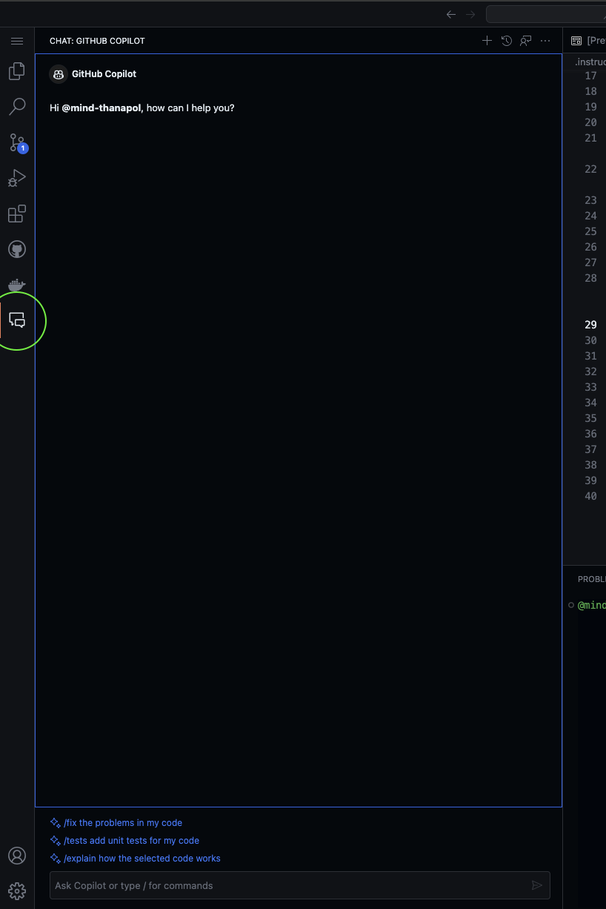
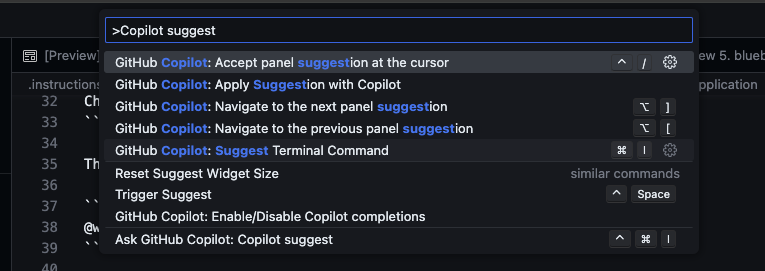
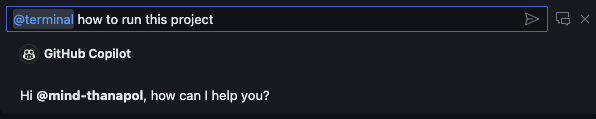
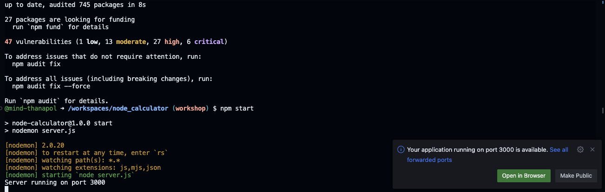
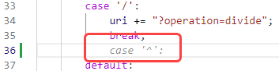
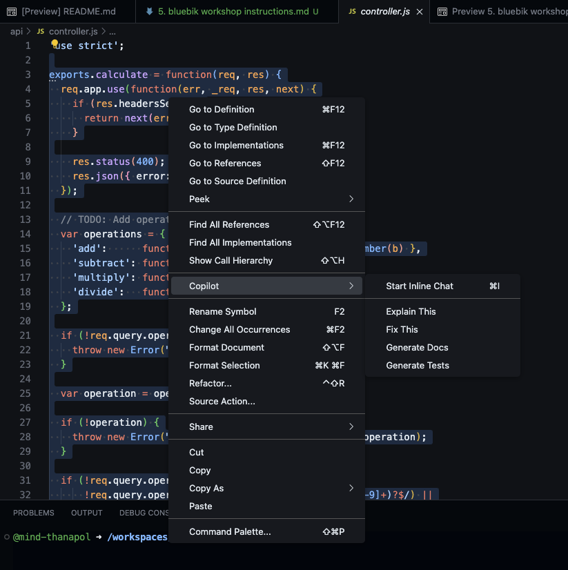
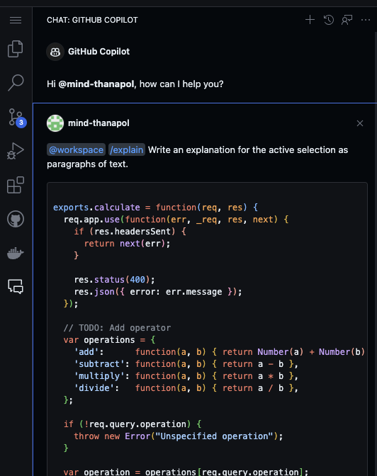
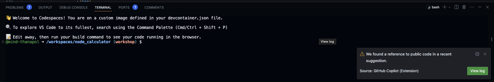
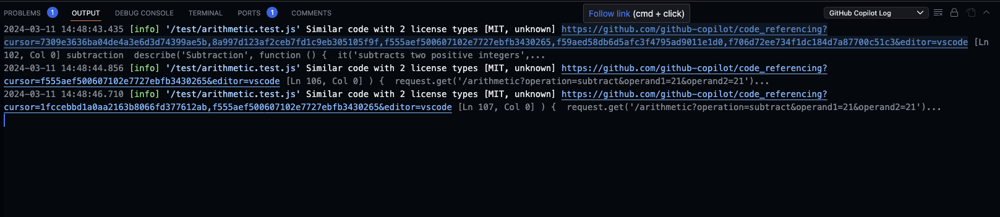
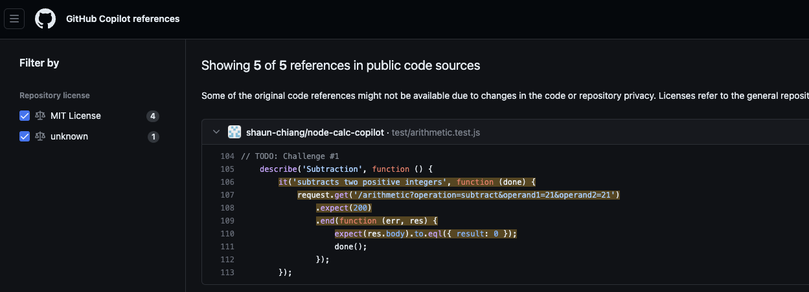

# GitHub Copilot Workshop

Welcome to the GitHub Copilot Workshop! In this workshop, we will explore the capabilities of GitHub Copilot, an AI-powered coding assistant developed by GitHub and OpenAI. GitHub Copilot is designed to help developers write code faster and more efficiently by providing intelligent code suggestions and completions. Whether you are a beginner or an experienced developer, this workshop will introduce you to the features and functionality of GitHub Copilot, allowing you to harness its power and enhance your coding experience. Let's dive in and discover the possibilities with GitHub Copilot!

## Project Description


In this workshop, we will work on an example project that is a web calculator capable of handling basic arithmetic operations.
The example project is a simple mono repo that will contain both the server-side logic (in api folder) and client-side content (in the public folder). The server side is an express.js application running a server on port 3000 serving an HTML page that renders as a calculator for the user to interact with.


## Setup the environment

We will use Github's Codespaces as a platform for this workshop. We will begin by creating a new branch in our repository 
1. Click View All branch
2. Click the new branch button
3. Enter your branch name (workshop/{your GitHub username})
4. Make sure that the source branch is 'main'

Once the branch is created, select the code button and ensure that the button inside the codespaces says "Create 
Codespaces on {your newly created branch}". If it's still a main branch, please follow the previous step to create a new branch before proceeding to codespaces.

## Github Codespaces
You can find more information about GitHub Codespaces [here](https://github.com/features/codespaces)

## Github Copilot Chat
We can ask Copilot to describe or explain the project using the Github Copilot Chat feature, for the local editor, and make sure that the Github Copilot extension is already installed. You can access Copilot's chat by clicking on the chat icon on the toolbar, or in a command palette




```
Chat: Open Quick Chat
```

Then, we can use this prompt:

```
@workspace explain what this project is
```

To which Copilot should give us an explanation of what this project is and its structure. The @workspace keyword here is to tell Copilot that the context or scope of the question that we are asking for refers to the workspace or the current files in this project. Others scope such as @terminal which will change the scope to the command line that we can use with terminal or @vscode which are about the vscode itself. Moreover, you can also ask Copilot in Thai as well, try it!

## Running the application
Copilot can also tell us how to run this project! we can start by asking Copilot through the chat panel that we used earlier, or use a dedicated prompt from the command palette.  



Which will redirect you to this pop-up 



We can use it as we would in a chat panel, by asking 
```
@terminal how to run this project
```
Which Copilot should answer that we can use 
```
npm install
```
and
```
npm start
```


Running this in the terminal should result in 



Select the Open in Browser to see our application

# Core Exercises
Our calculator can easily perform basic arithmetic operations (+,-,*,/) but what if we want to perform the power/exponentials function?

Let's see how Copilot will help us achieve that 

# Add a new button
1. Open the ```public/index.html``` file in the editor window.

2. Scroll down to where you see the ```<!-- TODO: Buttons -->``` comment

3. Add a new line below this comment and type the following two lines. You should see GitHub Copilot start to autocomplete the second line as you type. When you see this, just press ```TAB``` to accept the completion.


``` <!-- add a button for a power (or exponential) function --> ```
``` <button class="btn" onClick="operationPressed('^')">^</button> ```

4. Your finished snippet should match the following.


Before we move to the next files, through the command palete, Enter `GitHubCopilot: Open Completions Panel` and see the extent to what Copilot can understand us. 


### Adding the logic for the new features

5. Open the ```api/controller.js``` file in the editor window.

6. Scroll down to where you see the ```// TODO: Add operator``` comment

7. Press **ENTER** at the end of the line that defines the divide function.

8. Start typing the following line and notice that GitHub Copilot should start to offer code completion halfway through the word "power" as you're typing. Press **TAB** to accept the suggestion.

```'power':    function(a, b) { return Math.pow(a, b) },```

9. Open the ```public/client.js``` file in the editor window.

10. Scroll down to where you see the ```// TODO: Add operator``` comment (Line 22)

11. Move your cursor to the end of line 35 (to the right of ``` break;``` and press **ENTER**.

GitHub Copilot should display ghost text suggesting the code shown in the following screenshot. Press **TAB** to accept the suggestion.



12. Press **ENTER** at the end of the line, then accept the next two lines Copilot suggests.

Your completed addition should match the following.


13. Press ```CTRL + ` ``` to open the terminal window in VS Code.

14. Enter ```npm start``` in the terminal window and press **ENTER** to run the application.

15. You should test the new button by clicking 3, then the "^" (power) button, and click 2. Click "=" and the result should be 9.

16. Close the browser window, return to the Terminal window in Codespaces, and press ```CTRL+C``` to terminate the application.


## Challenge Exercises
Our new feature is working as expected, but now we want to create a unit test for it. Can Copilot help with this?

We will go over one of the test cases as an example, then you can complete the rest on your own.

1. Head over to the `/test` folder
2. Open the `arithmetic.test.js`
3. Currently there are multiple test cases for validation, addition, multiplication, and divide but none for subtraction operation
4. Ask Copilot to help us create a new test case by writing this comment `// Write test cases for subtraction`
5. You should see Copilot giving a suggestion, we will accept all of the suggestions for the first test case.
6. Continue and explore the capability of the auto-complete suggestion based on the given pattern of Copilot, and see if you or Copilot can come up with more test cases!


## Copilot Chat commands and more
When browsing the content of any file in an editor, you can also highlight any block of code and right-click to open the Copilot menu



We can use inline chat to create a chat session with Copilot with the selected block of code as a given context, or we can ask Copilot to explain, fix, or generate a document or even test for us!  For now let's use the <i>Explain This</i> function



This is a shortcut prompt to Copilot chat using @workspace that we talked about earlier, and the <i>/explain</i> slash command tells Copilot chat that we want them to <b>explain</b> the given context. There are many slash commands as well such as /test, and/doc. You can read more about them [here](https://devblogs.microsoft.com/visualstudio/copilot-chat-slash-commands-and-context-variables/)

Throughout this workshop, we can see that it's very good at translating human-readable text into programming language, but what about programming language into human language? 

Let's say you are a developer or tester who needs to generate a summary or a report from the given test case. In our case, the content inside `arithmetic.test.js` can be easily read and understood, but what if the tests are not in a unit of 10, but a hundred? Again, let's see if Copilot can help us summarize the test cases in detail for us, not as a paragraph, but as a format of our choice. 


First, highlight and select the entirety of the `arithmetic.test.js` file, then use the inline chat option. Try typing this prompt and see what Copilot can do!
```summarize the test cases in CSV format```

## Public Code Snippet
Sometimes Copilot may found a reference to the public code in their suggestion. This will result in a pop-up window such as this:




Viewing the log will take you to the GitHub Copilot Log:



Where you can see more details by clicking on the references link:



With this, we can decide whether we should use the similar code that was suggested by Copilot if there are any conflicting licenses with our code

## Wrapping Up

While Copilot is a tremendously powerful tool, we must be cautious as to how we are using it. Remember, Copilot is there to assist us in our programming journey, not to directly take over your wheel and take you to the destination. Throughout this demonstration we can see that Copilot is good at performing a task with proper guidance or with an existing pattern, allowing you to focus on the core business logic and overall structure and thus improve the overall productivity for you and your team. Have fun coding!
